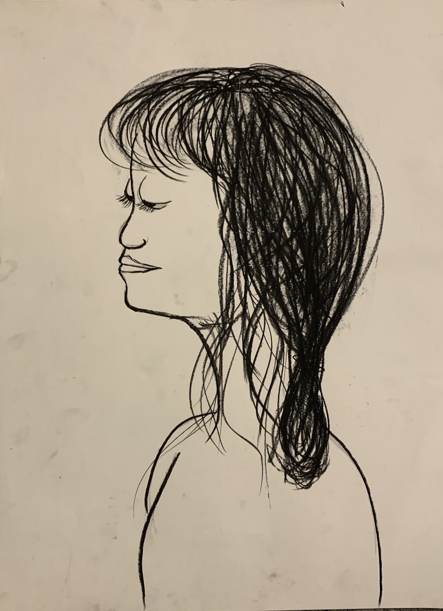
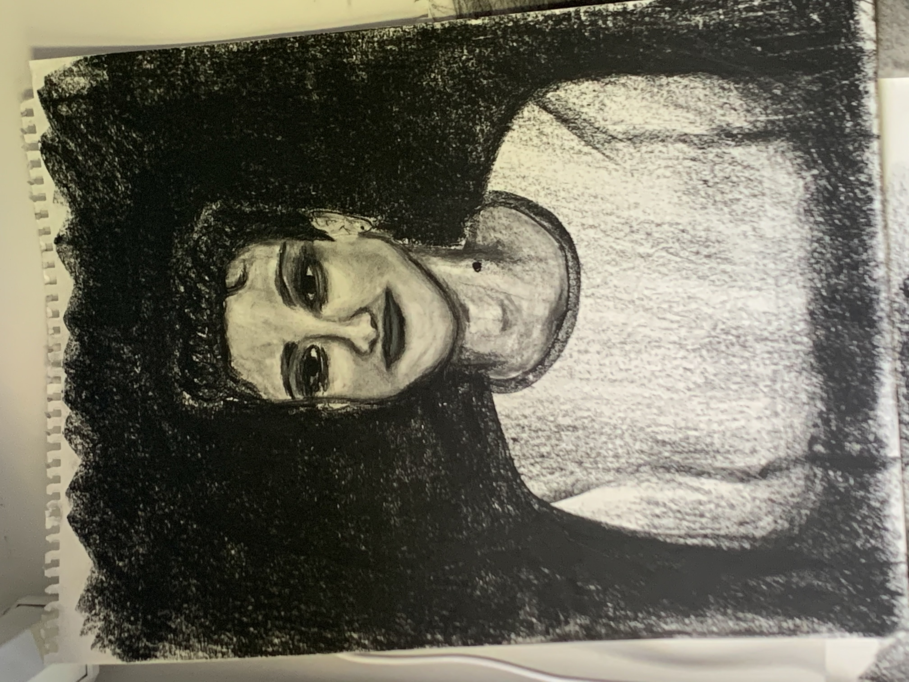

# Self Portrait

 <!-- The grid: four columns -->

  

    
  

  

    
  

  

    
  

  

    
  

<!-- The expanding image container -->

  <!-- Close the image -->
  &times;

  <!-- Expanded image -->
  

  <!-- Image text -->
  

 

 /* The grid: Four equal columns that floats next to each other */
.column {
  float: left;
  width: 25%;
  padding: 10px;
}

/* Style the images inside the grid */
.column img {
  opacity: 0.8;
  cursor: pointer;
}

.column img:hover {
  opacity: 1;
}

/* Clear floats after the columns */
.row:after {
  content: "";
  display: table;
  clear: both;
}

/* The expanding image container (positioning is needed to position the close button and the text) */
.container {
  position: relative;
  display: none;
}

/* Expanding image text */
#imgtext {
  position: absolute;
  bottom: 15px;
  left: 15px;
  color: white;
  font-size: 20px;
}

/* Closable button inside the image */
.closebtn {
  position: absolute;
  top: 10px;
  right: 15px;
  color: white;
  font-size: 35px;
  cursor: pointer;
} 

A socially-distanced durational performance installation in the works, “Self Portrait” is to be composed of a video sculpture and walls filled with images: images of people, of friends, of family.

Guests will be able to submit a photo ahead of time of someone special to them, and then to see charcoal drawings of their loved ones, alongside everyone else’s special people, realized in the piece. Visitors will be invited to take a portrait home, but not one of the images created from the photo they sent.

Only a few participants will experience the installation at a given time to maintain social distancing, but this also allows me an opportunity to create interactivity between their proximity to the walls and the audio in the video: as they approach the walls where the portraits hang, a previously indistinguishable track from the audio will become clear, creating a sense of community and presence despite distance.

I will be in the room the whole time, drawing continuously to replenish the walls as folks take down the images that strike them — images of people they don’t know, but whom they know are special to someone.

More info to come as the project develops. If you are interested in participating in any way or want to suggest a venue please reach out at emilytwines@gmail.com! 

[back](./)
